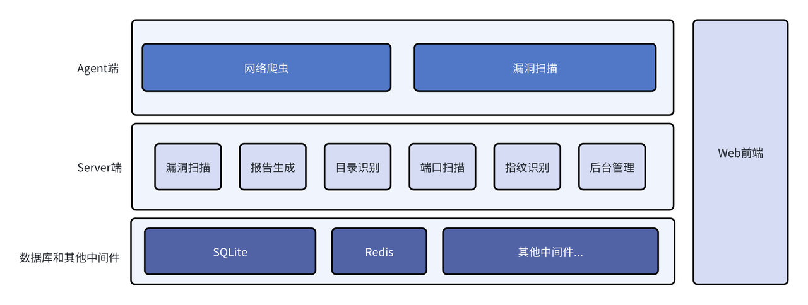
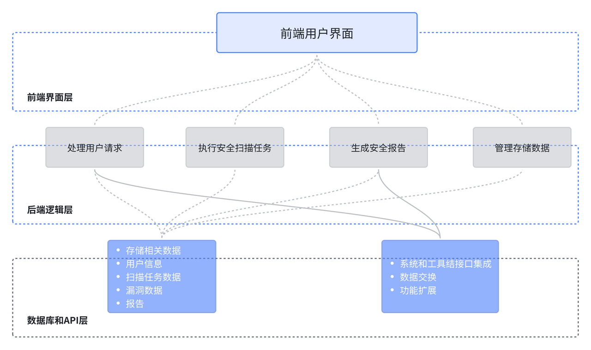
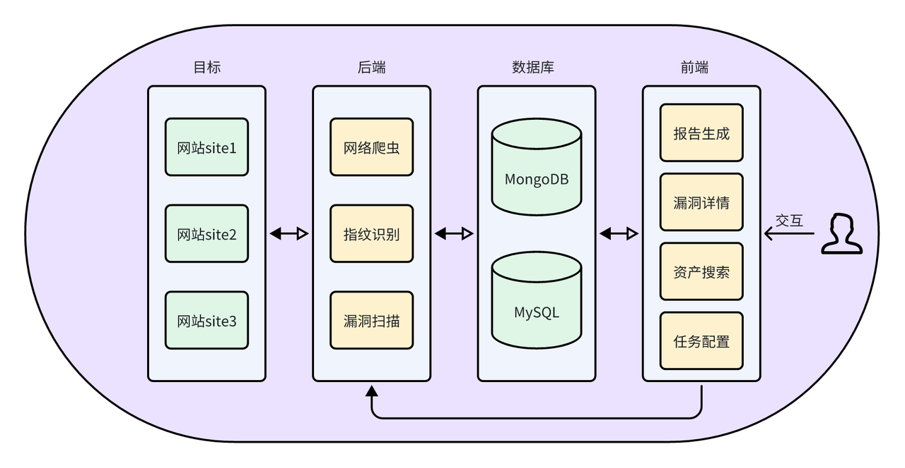
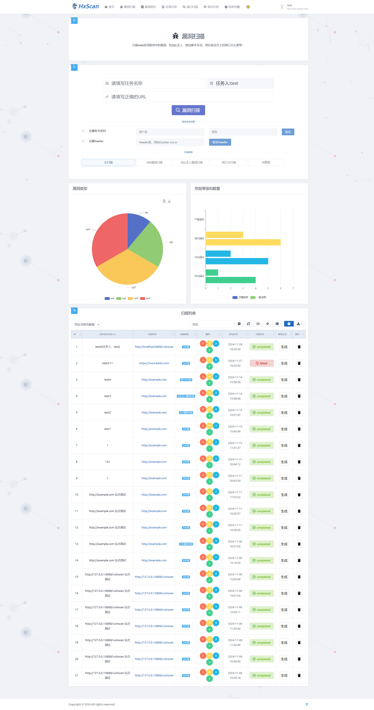
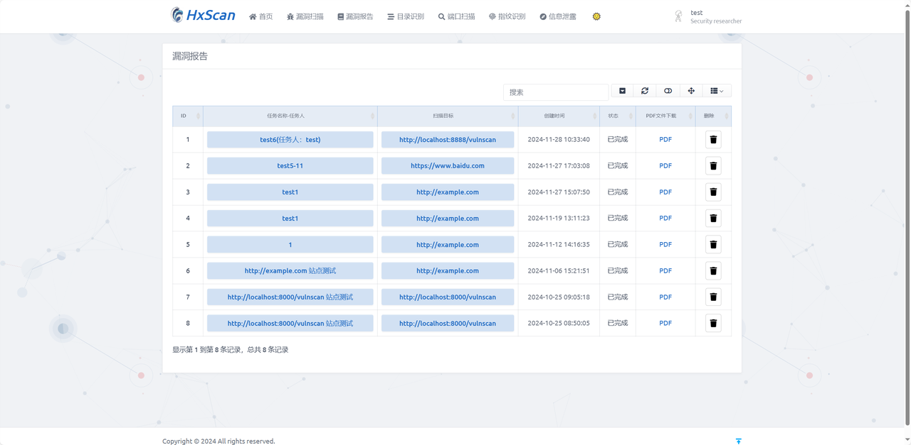

# HxScan

## 🌱项目介绍

### 系统简介

本项目命名为HxScan，是一款**多功能 Web 应用渗透测试系统**，主要功能包含**漏洞检测、报告生成、目录识别、端口扫描、指纹识别、信息泄露**功能。同时引入了基于**SimpleUI**的后台管理框架。
默认账号密码：admin/password..!!
整体架构：

系统层次结构图：

数据流程图：


### 功能介绍

#### 漏洞检测

漏洞检测功能主要调用AWVS实现。使用如下代码镜像本地部署AWVS，使用的是Beat版本，可以更好的兼容。

```bash
#!/bin/bash
docker pull sakura501/hxscan-tool:beta
docker run -it -d -p 3443
```

调用接口具体查看vulnscan中的API，其中Base如下：

```python
#!/usr/bin/env python
# -*- coding: utf-8 -*-
import os
from logging.config import fileConfig
import requests
import logging
from os import path
# import requests.packages.urllib3
# from os.path import dirname, join
# from Sec_Tools.settings import API_KEY, API_URL
# API_URL = 'https://127.0.0.1:3443'
# API_KEY = '1986ad8c0a5b3df4d7028d5f3c06e936c61f48e0cd8c4462cb03d6a2f7c03deb4'

class Base(object):
    def __init__(self, api_base_url, api_key):
        self.api_base_url = api_base_url
        self._api_key = api_key
        # self._api_key = None

        # api_base_url = api_base_url.strip('/')
        api_base_url = self.api_base_url.strip('/')
        self.targets_api = f'{api_base_url}/api/v1/targets'
        self.scan_api = f'{api_base_url}/api/v1/scans'
        self.vuln_api = f'{api_base_url}/api/v1/vulnerabilities'
        self.report_api = f'{api_base_url}/api/v1/reports'
        self.create_group_api = f'{api_base_url}/api/v1/target_groups'

        self.report_template_dict = {
            'affected_items': '11111111-1111-1111-1111-111111111115',
            'cwe_2011': '11111111-1111-1111-1111-111111111116',
            'developer': '11111111-1111-1111-1111-111111111111',
            'executive_summary': '11111111-1111-1111-1111-111111111113',
            'hipaa': '11111111-1111-1111-1111-111111111114',
            'iso_27001': '11111111-1111-1111-1111-111111111117',
            'nist_SP800_53': '11111111-1111-1111-1111-111111111118',
            'owasp_top_10_2013': '11111111-1111-1111-1111-111111111119',
            'pci_dss_3.2': '11111111-1111-1111-1111-111111111120',
            'quick': '11111111-1111-1111-1111-111111111112',
            'sarbanes_oxley': '11111111-1111-1111-1111-111111111121',
            'scan_comparison': '11111111-1111-1111-1111-111111111124',
            'stig_disa': '11111111-1111-1111-1111-111111111122',
            'wasc_threat_classification': '11111111-1111-1111-1111-111111111123',
            'comprehensive':'11111111-1111-1111-1111-111111111126'
        }

        # 禁用https证书相关警告
        requests.packages.urllib3.disable_warnings()

    @property
    def auth_headers(self):
        auth_headers = {
            'X-Auth': self._api_key,
            'content-type': 'application/json'
        }
        return auth_headers

    @property
    def get_logger(self):
        logging_config = path.join(path.dirname(path.abspath(__file__)), '../config/logging.ini')
        logging.config.fileConfig(logging_config)
        return logging.getLogger('awvs')
```

前端功能页面如下:


#### 漏洞报告

在漏洞测试下方的扫描列表，点击对应扫描任务中的生成按钮，会在漏洞报告栏目中生成相应的报告，这里提供PDF版本的下载。


#### 目录识别

调用dirsearch工具：[dirsearch](https://github.com/maurosoria/dirsearch)
使用SQLite对每一次目录识别任务进行记录，展示在下方的列表，同时保存每次的目录识别记录。

#### 端口扫描

具体功能代码见：[portscan](https://github.com/ZongaoHuang/HXAWVS/tree/main/webscan_backend/plugins/portscan)

#### 指纹识别

具体功能代码见：[fingerprint](https://github.com/ZongaoHuang/HXAWVS/blob/main/webscan_backend/urls.py)

#### 信息泄露

具体功能代码见：[infoleak](https://github.com/ZongaoHuang/HXAWVS/tree/main/webscan_backend/plugins/infoleak)

#### 后台管理

进入**URL/admin**进入后台管理页面，使用SimpleUI框架。
